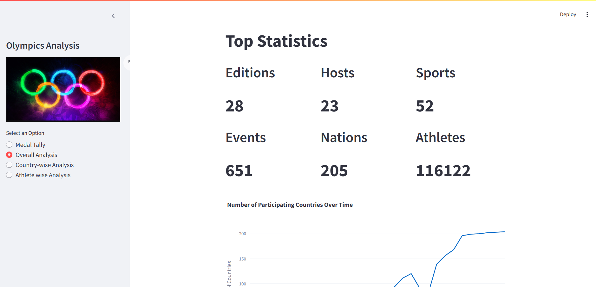
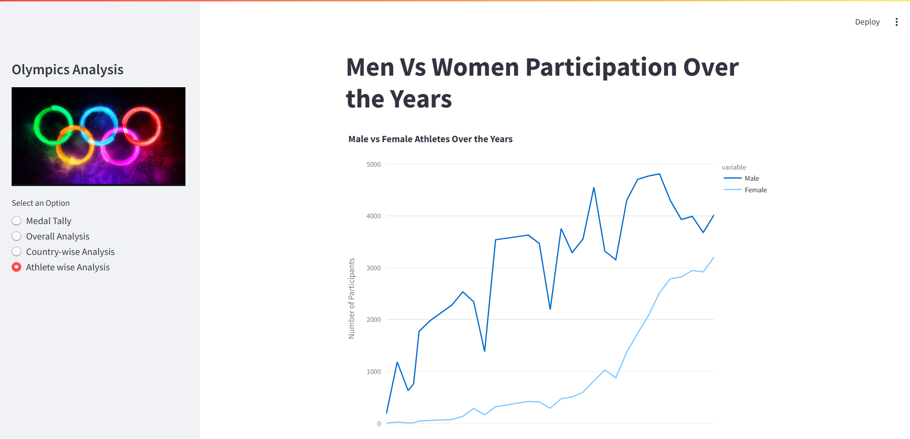
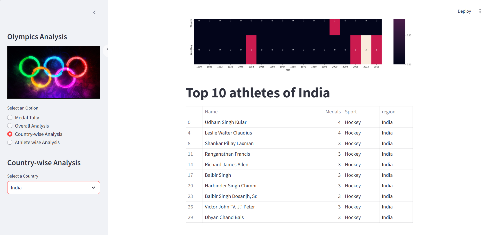

# Olympics Dashboard Project

## Overview

This is a simple data analysis dashboard built using Streamlit. The idea is to let users explore historical Olympic data in an interactive way. You can check medal tallies, athlete stats, country performances, and more. The datasets used are taken from Kaggle — athlete_events.csv and noc_regions.csv.

## Files and Structureolympics-dashboard/
├── app.py --> Main Streamlit app
├── helper.py --> Data analysis related functions
├── preprocessor.py --> Data cleaning and preprocessing
├── athlete_events.csv --> Olympics dataset
├── noc_regions.csv --> Country code mapping
└── README.md --> You're reading this :)


## What This App Can Do

- See medal counts by country and year  
- View top performing athletes by sport  
- Check country-wise progress over time  
- Explore participation stats of men and women  
- Use dropdowns to filter and explore easily  
- Visualizations are made using Plotly and Matplotlib

## Tech Stack

- Python (Pandas, NumPy)
- Streamlit
- Plotly, Matplotlib
- Seaborn (a bit)
- Used Jupyter for exploring data initially

### 📊 Dataset Source
- [Kaggle: Olympic History Dataset](https://www.kaggle.com/datasets/heesoo37/120-years-of-olympic-history-athletes-and-results)


### Demo Screenshots
Below are key views from the interactive Streamlit dashboard.

### 🎯 Overall Analysis


---

### 🥇 Medal Tally View


---

### 👤 Athlete-wise Analysis


---

### 🏅 Top 10 Athletes



## To Run This App

Make sure Python is installed. Then:

```bash
git clone https://github.com/your-username/olympics-dashboard.git
cd olympics-dashboard
pip install -r requirements.txt
streamlit run app.py

AUthor
Built by Divyansh as part of his hands-on learning in data analysis and dashboarding.  
Inspired by CampusX’s structure but extended, cleaned, and packaged independently as a professional portfolio project.

